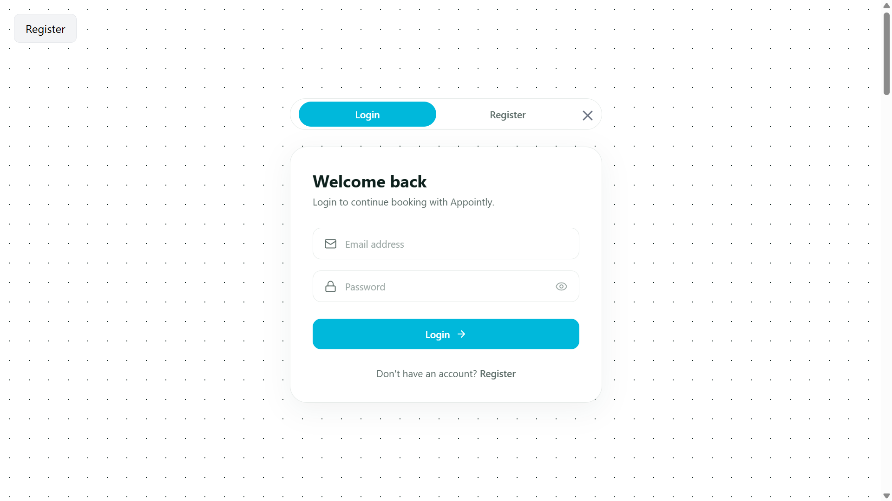
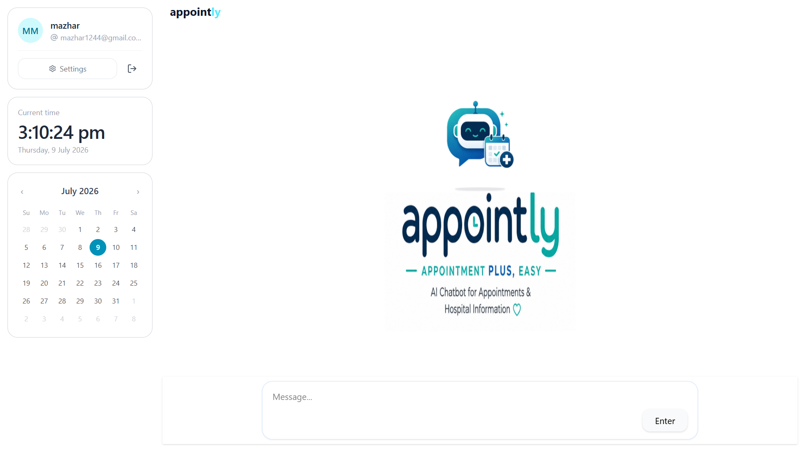
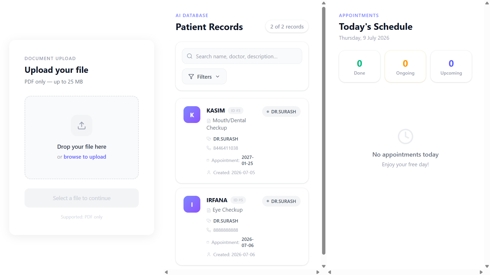
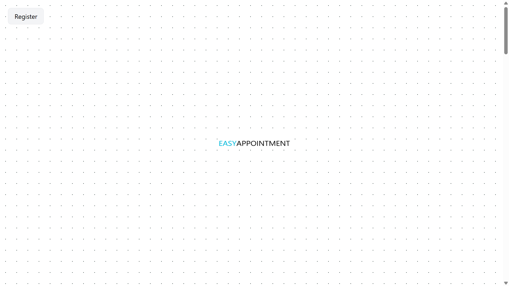
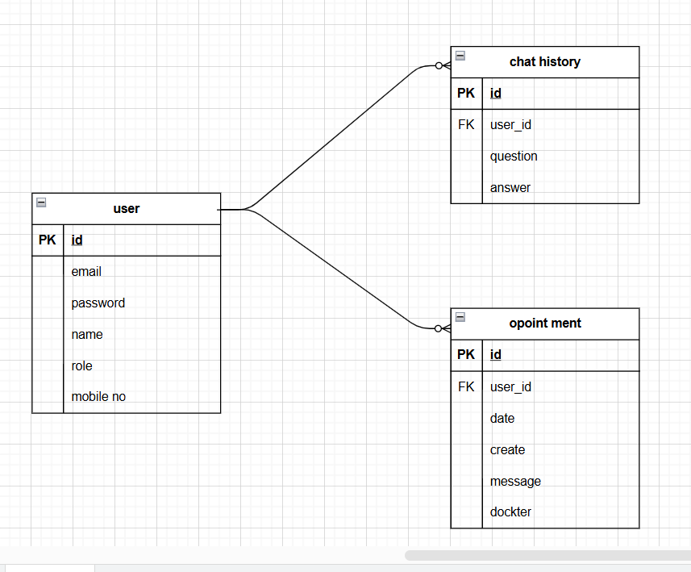
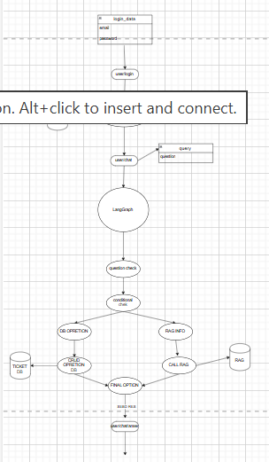
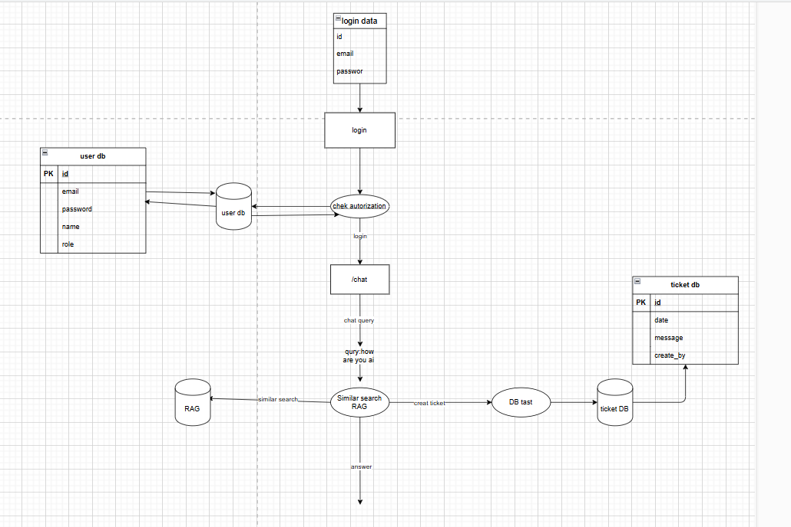

<div align="center">

# 🩺 SupportAI

**AI-powered Hospital Appointment & Support System**
Chatbot-driven appointment booking with RAG-based hospital knowledge, role-based access, and automated email reminders.

</div>

---

## 📸 Preview

<table>
<tr>
<td width="50%">

**Login**


</td>
<td width="50%">

**AI Chat Assistant**


</td>
</tr>
<tr>
<td width="50%">

**Admin — Patient Records & Today's Schedule**


</td>
<td width="50%">

**Landing Page**


</td>
</tr>
</table>

---

## ✨ Features

### 🤖 AI Chat Assistant
- Conversational chatbot for booking, checking, and managing hospital appointments
- **RAG (Retrieval-Augmented Generation)** pipeline over hospital data (services, doctors, timings, policies) using **ChromaDB** as the vector store
- **LangChain + LangGraph** powered agent that intelligently routes each query — either to a **database operation** (appointment CRUD) or to **RAG-based knowledge retrieval** — before generating the final response
- Live/real-time search over hospital data for up-to-date answers

### 📅 Appointment Management
- Users can book, view, and track their own appointments through natural chat
- Real-time dashboard: **Done / Ongoing / Upcoming** appointment counters
- Admin can view all patient records, search/filter by name, doctor, or description
- Admin can view and delete **today's appointments**

### 👥 Role-Based Access Control
| Capability | User | Admin |
|---|:---:|:---:|
| Chat with AI assistant | ✅ | ✅ |
| Book / view own appointments | ✅ | ✅ |
| Ask hospital-related questions (RAG) | ✅ | ✅ |
| View all patient records | ❌ | ✅ |
| Upload new hospital documents to RAG | ❌ | ✅ |
| Delete data from knowledge base | ❌ | ✅ |
| Delete today's appointments | ❌ | ✅ |

### 📁 Document Upload (Admin — RAG Knowledge Base)
- Drag-and-drop / browse-to-upload interface for PDF documents (up to 25 MB)
- Uploaded documents are chunked, embedded, and stored in **ChromaDB** to keep the AI's hospital knowledge up to date

### 📧 Automated Email Notifications (Celery + Redis)
- Confirmation email sent on login/appointment booking
- **Celery** background workers automatically send **appointment reminder emails on the scheduled date**
- **Redis** used as the Celery message broker and for caching frequent queries

### 🔐 Authentication
- Secure login/register flow with hashed passwords
- Role-based session handling (`user` / `admin`)

### 🐳 DevOps
- Fully **Dockerized** (frontend + backend + services)
- **CI/CD pipeline** via GitHub Actions (`.github/workflows/deploy.yml`) for automated build & deployment

---

## 🏗️ System Architecture

**Overall request flow — login → chat routing → RAG / DB operation → response:**


**LangGraph agent decision flow (DB operation vs RAG retrieval):**


---

## 🗃️ Entity Relationship Diagram (ERD)



**Core tables:**

| Table | Fields |
|---|---|
| **user** | `id (PK)`, `email`, `password`, `name`, `role`, `mobile_no` |
| **chat_history** | `id (PK)`, `user_id (FK)`, `question`, `answer` |
| **appointment** | `id (PK)`, `user_id (FK)`, `date`, `create`, `message`, `docter` |

---

## 🛠️ Tech Stack

| Layer | Technology |
|---|---|
| **Frontend** | React.js, Tailwind CSS |
| **Backend** | Python, FastAPI, Uvicorn |
| **Database** | PostgreSQL |
| **Vector DB** | ChromaDB |
| **AI / Agent** | LangChain, LangGraph (RAG + tool-routing agent) |
| **Caching / Broker** | Redis |
| **Background Jobs** | Celery (email sending, scheduled reminders) |
| **Containerization** | Docker, Docker Compose |
| **CI/CD** | GitHub Actions |

---

## 📂 Project Structure

```
SupportAI/
├── .github/
│   └── workflows/
│       └── deploy.yml              # CI/CD pipeline
├── saas_imgs/
│   ├── digram_1.png                # ER Diagram
│   ├── digram_2.png                # System architecture flow
│   ├── digram_3.png                # LangGraph agent flow
│   └── screenshots/                # Frontend UI screenshots
│       ├── login.png
│       ├── chat-dashboard.png
│       ├── patient-records.png
│       └── landing.png
├── src/
│   ├── AI/
│   │   ├── Rag.py                  # RAG pipeline logic
│   │   ├── agents.py               # LangGraph agent definitions
│   │   ├── ai_main.py              # AI entrypoint
│   │   └── db_opretions.py         # DB operation tools for the agent
│   ├── celery/
│   │   ├── celery_app.py           # Celery app config
│   │   ├── email_connection.py
│   │   ├── email_send.py
│   │   └── email_send_by_date.py   # Appointment reminder scheduler
│   ├── controller/
│   │   ├── admin.py
│   │   ├── auth.py
│   │   └── chat.py
│   ├── db/
│   │   ├── DataBase.py             # PostgreSQL connection
│   │   └── vector_db.py            # ChromaDB connection
│   ├── helper/
│   │   ├── chat_his.py
│   │   ├── is_admin.py
│   │   └── is_authanticat.py
│   ├── model/
│   │   ├── ai_operation.py
│   │   └── user.py
│   ├── redis/
│   │   └── connection.py
│   ├── routes/
│   │   ├── admin.py
│   │   ├── auth.py
│   │   └── chat.py
│   └── schemas/
│       ├── db_schema.py
│       ├── email_schema.py
│       ├── graph_schema.py
│       └── user.py
├── .dockerignore
├── .env.docker
├── .gitignore
├── api_design.drawio
├── db_design.drawio
├── docker-compose.yml
├── dockerfile
├── main.py
├── pyproject.toml
├── start.sh
└── uv.lock
```

---

## ⚙️ Environment Variables

Create a `.env` (or `.env.docker`) file in the project root:

```env

# frontend
VITE_SERVER =https://s.......

# DATABASE_URL=postg............
DATABASE_URL=postgresq.................
SECRETE_KY=m.................
GROQ_API=gsk_JSFHvhX..........
SEARCH_KEY=e1531............
SQL_GROQ_API=gsk_3..........
TOKEN_EXP=30
PINECONE=pcsk_4tN5SW_Ej3........
REDIS_HOST=sprout-se.........
REDIS_PORT=........
REDIS_DB=0
REDIS_USERNAME=........
REDIS_PASSWORD=JiLp7yM7Z7E...........Y
```

---

## 🚀 Getting Started

### Run with Docker (recommended)

```bash
git clone https://github.com/username/SupportAI.git
cd SupportAI
docker-compose up --build
```

### Run backend manually

```bash
cd SupportAI
uv sync                     # or pip install -r requirements.txt
uvicorn main:app --reload --port 8000
```

### Run Celery worker (for email reminders)

```bash
celery -A src.celery.celery_app worker --loglevel=info
```

### Frontend

```bash
cd frontend
npm install
npm run dev
```

---

## 🔗 Related Repositories

- Frontend: [supportai-frontend](https://github.com/username/supportai-frontend)
- Backend: this repository

---

## 📌 Diagram Sources

Editable `.drawio` source files are included for reference:
- [`api_design.drawio`](./api_design.drawio)
- [`db_design.drawio`](./db_design.drawio)

Open them at [app.diagrams.net](https://app.diagrams.net) to edit.
